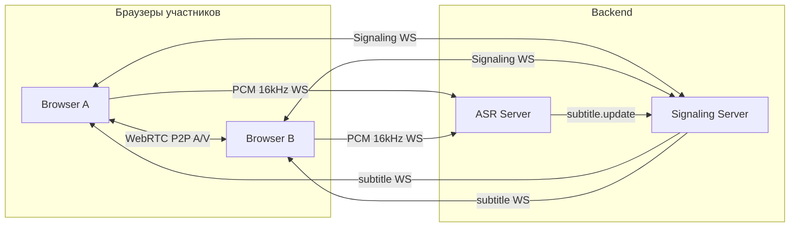

# ru-tat-call

Self-hosted семейные видеозвонки с живыми субтитрами для смешанной русско-татарской речи.

Открываешь ссылку в браузере на телефоне или ноутбуке — и уже в звонке с потоковым распознаванием речи. Система понимает code-switching: фразы, где русский и татарский перемешаны в одном потоке, без ручного переключения языка.

## Возможности

- **PWA mobile-first** — Safari на iPhone, Chrome на Android, десктоп; установка на главный экран
- **WebRTC mesh** — аудио и видео до 4 участников, P2P между браузерами
- **Потоковое ASR** — partial и final субтитры в реальном времени
- **Code-switching ru/tt** — смешанная речь как один поток распознавания
- **Подпись говорящего** — каждая реплика с именем участника
- **Silero VAD** — отсечение тишины на CPU, снижение нагрузки на ASR
- **Постобработка транскриптов** — читаемые субтитры без искажения смешанной речи
- **GPU ASR worker** — отдельный Colab-воркер для инференса на GPU
- **Авторизация и контакты** — сессии, список контактов, быстрый запуск звонка
- **Reconnect** — звонок продолжается при кратком обрыве signaling или ASR WebSocket
- **Docker Compose** — один команда для UI, signaling и ASR
- **HTTPS tunnel** — Cloudflare Tunnel для доступа с мобильных (камера и микрофон)

## Архитектура



| Компонент | Роль |
| --- | --- |
| **Web Client** | UI звонка, захват камеры/микрофона, даунсемплинг в 16 kHz PCM, оверлей субтитров |
| **Signaling Server** | Авторизация, комнаты, обмен SDP/ICE, раздача субтитров участникам |
| **ASR Server** | Потоковое распознавание: VAD, инференс, partial/final события |
| **WebRTC** | Прямой P2P обмен аудио и видео между браузерами |

## Стек

Python 3.10+, FastAPI, WebSockets, Pydantic v2, uv, SQLite, Vanilla JS, WebRTC, Web Audio API, Docker, Silero VAD, Cloudflare Tunnel.

## Быстрый старт

### Docker (рекомендуется)

```bash
git clone git@github.com:Dan1kMiniTogi/ru-tat-call.git
cd ru-tat-call/project
docker compose -f infra/docker-compose.yml up --build
```

Откройте http://127.0.0.1:8000/

### Локально

Нужны Python 3.10+ и [uv](https://docs.astral.sh/uv/).

```bash
git clone git@github.com:Dan1kMiniTogi/ru-tat-call.git
cd ru-tat-call/project
uv sync --all-packages --group dev
cp .env.example .env
uv run uvicorn signaling_server.app:app --host 0.0.0.0 --port 8000 --proxy-headers --forwarded-allow-ips='*'
uv run uvicorn asr_server.app:app --host 0.0.0.0 --port 8001
```

UI: http://127.0.0.1:8000/ — ASR на том же origin через `/v1/asr-stream`.

### Доступ с телефона

```bash
cd project
./infra/tunnel.sh
```

Скрипт поднимает Cloudflare Tunnel и даёт HTTPS-ссылку для Safari и Chrome.

## Демо-аккаунты

После первого запуска доступны быстрый вход:

| Идентификатор | Пароль |
| --- | --- |
| `you` | `family` |
| `mama` | `family` |
| `sister` | `family` |

## Структура проекта

| Путь | Описание |
| --- | --- |
| `project/services/signaling_server/` | FastAPI: REST, WebSocket, статика веб-клиента |
| `project/services/asr_server/` | Потоковый ASR: VAD, инференс, WebSocket |
| `project/web_client/` | Mobile-first PWA: HTML, CSS, Vanilla JS |
| `project/shared/` | Общие Pydantic-контракты и конфигурация |
| `project/apps/colab_asr/` | GPU ASR worker для Colab |
| `project/infra/` | Docker, docker-compose, tunnel-скрипты |
| `project/tests/` | Интеграционные и e2e тесты |

Подробности запуска — в [`project/README.md`](project/README.md).
